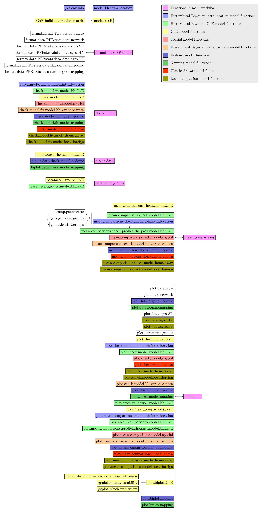

# Contribute to PPBstats

Contributions to `PPBstats` are very welcome and can be made in four different ways: 

1. testing the package and reporting bugs, 
2. improving the code, 
3. improving the documentation and 
4. translating


Anyhow, send me an email if you wish to participate in order to coordinate our efforts: pamriviere@protonmail.com

## Test and report bugs

First, download and install the current version of the package as explained [here](../docs/1.install.html).

The easiest way to start is to [look at the book](../docs/articles/2.book.html) to know how the package works.


Do not hesitate to let a message [in the issues](https://github.com/priviere/PPBstats/issues) if

- some points are not clear in the book or you find bugs
- you find bugs with your data (If so, you can send it to me so that I can see
where could be the problems)


## Improve the code

The code of PPBstats is on github : https://github.com/priviere/PPBstats


### Resolve open issues

Do not hesitate to contribute to open [issues](https://github.com/priviere/PPBstats/issues).

### Add new functions

If you have any ideas, 

- on the improvement of the current package (graph or table for example)
- on new functions that may be useful in the analysis found within PPB programmes regarding network of seeds circulation, agronomic trials, organoleptic tests and molecular experiments.
- ...

even if it is not R written, send me an email and we'll see how we can work together!

If you wish to add a new model, you should follow different steps :

- create the model function
```R
my_model <- function(...){
  ...
  ...
  ...
  class(out) = c("PPBstats", "fit_my_model")
  return(out)
  }
```

- create the `fit_my_model` method for `check_model()`
```R
check_model.fit_my_model <- function(x){
  ...
  ...
  ...
  class(out) <- c("PPBstats", "check_my_model")
  return(out)
  }
```

- create the `check_my_model` method for `plot()`
```R
plot.check_my_model <- function(x, y, ...){
  ...
  ...
  ...
  }
```


- create the check_my_model method for `mean_comparisons()`
```R
mean_comparisons.check_my_model <- function(x, ...){
  ...
  ...
  ...
  class(out) <- c("PPBstats", "mean_comparisons_my_model")
  return(out)
  }
```

- create the `mean_comparisons_my_model` method for `plot()`
```R
plot.mean_comparisons_my_model <- function(x, y, ...){
  ...
  ...
  ...
  }
```

- It may be useful to edit `parameter_groups()` and `post_hoc_variation()` functions.

### Internal function structure

The internal function used in `PPBstats` are presented in Figure below. 
Note that one additional funtion is also defined in the package: `common_functions` which gather some functions used in several functions of `PPBstats`.




A description of each function can be found [here](../docs/reference/index.html)


## Improve the documentation

The book has been generated thanks to [`bookdown`](https://bookdown.org/yihui/bookdown/).

If you wish to improve the web site, the book, to add new sections on PPB, etc please file an [issue](https://github.com/priviere/PPBstats/issues) or send me an email : pamriviere@protonmail.com 

### Web site of `PPBstats`
The code of the website, generated by `pkgdown`, is on github: https://github.com/priviere/PPBstats/tree/master/vignettes.
To test any changes on the website:
```R
pkgdown::build_site()
```


### Book
The code of the book is on github: https://github.com/priviere/PPBstats/tree/master/inst/bookdown

If you are not familiar with the code, you can edit `docx` documents that can be downloaded [here](https://github.com/priviere/PPBstats/releases/download/v0.26/PPBstats_book_docx.zip).
Do not pay attention to strange words such as _#_, _[@blablabla]_, _\@ref_ ... that are `bookdown` specific.

If your familiar with the code, to test any changes on the book:
```R
bookdown::serve_book(dir = "inst/bookdown/")
```

Note that it may be useful not to run the book for all files, which is a bit long ...
You can edit `_bookdown.yml` by adding `rmd_files` argument.
Below is an exhautive list with all files. 

```{yaml}
book_filename: "PPBstats_book"
output_dir: docs
language:
  ui:
    chapter_name: "Chapter "
delete_merged_file: true
rmd_files: [
  "index.Rmd",
  "100-philo_pack.Rmd",
  "200-network.Rmd",
  "201-network_intro.Rmd",
  "202-network_unipart_seedlot.Rmd",
  "203-network_unipart_location.Rmd",
  "204-network_bipart.Rmd",
  "300-agro.Rmd",
  "301-agro_intro.Rmd",
  "302-agro_design_expe.Rmd",
  "303-agro_sow.Rmd",
  "304-agro_describe_data.Rmd",
  "305-agro_family_1.Rmd",
  "306-agro_classic_anova.Rmd",
  "307-agro_spatial_analysis.Rmd",
  "308-agro_ibd.Rmd",
  "309-agro_model_1.Rmd",
  "310-agro_family_2.Rmd",
  "311-agro_ammi.Rmd",
  "312-agro_gge.Rmd",
  "314-agro_model_2.Rmd",
  "315-agro_family_3.Rmd",
  "316-agro_model_3.Rmd",
  "317-agro_family_4.Rmd",
  "318-agro_response_to_selection.Rmd",
  "319-agro_local_adaptation.Rmd",
  "320-agro_variance_intra.Rmd",
  "321-agro_family_5.Rmd",
  "322-agro_multivariate_analysis.Rmd",
  "400-organo.Rmd",
  "401-organo_intro.Rmd",
  "402-organo_taste.Rmd",
  "403-organo_hedonic.Rmd",
  "404-organo_napping.Rmd",
  "405-organo_rank.Rmd",
  "500-molecular.Rmd",
  "600-communicate.Rmd",
  "700-tail.Rmd",
  "800-references.Rmd"
  ]

```

Just keep the file you want to test, for example only documentation regarding network:

```{yaml}
book_filename: "PPBstats_book"
output_dir: docs
language:
  ui:
    chapter_name: "Chapter "
delete_merged_file: true
rmd_files: [
  "index.Rmd",
  "100-philo_pack.Rmd",
  "200-network.Rmd",
  "201-network_intro.Rmd",
  "202-network_unipart_seedlot.Rmd",
  "203-network_unipart_location.Rmd",
  "204-network_bipart.Rmd",
  "800-references.Rmd"
  ]
```


### Web site with examples of reports
The code regarding examples of report fo farmers is on github: 
https://github.com/priviere/PPBstats/tree/master/inst/return_report_web_site.

To test any changes on the website:
```R
rmarkdown::render_site("inst/return_report_web_site/")
```


## Translate

The package and the book are in english. 
Every contributions to other languages are welcome!
More information on R package translation [here](http://developer.r-project.org/Translations30.html).


## Procedure to contribute to the code

- If you want to interact with us, please file an [issue](https://github.com/priviere/PPBstats/issues) or send me an email : pamriviere@protonmail.com
- Fork the git repository
- Include your contributions in your fork (preferably in a specific branch)
- Update the documentation if necessary (help files, `inst/bookdown` file)
- Write unit tests for your functions, if any
- Pull the latest changes in the `master` branch of the upstream repository and rebase your work on top of them.
- Run all tests and compile the vignette. Make sure everything works as
expected.
- Send a Pull Request with a reference to the original issue


