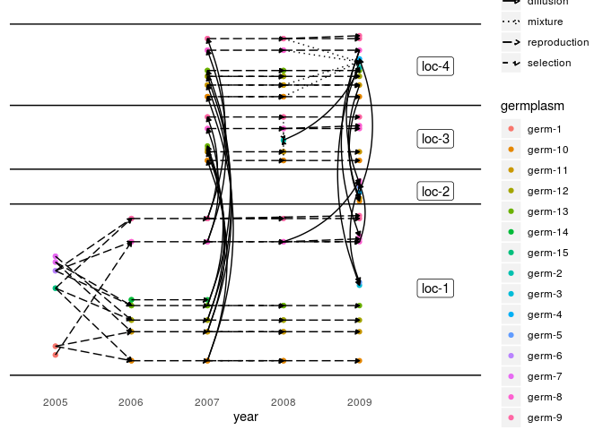
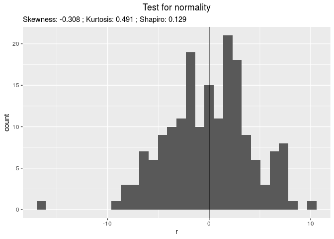
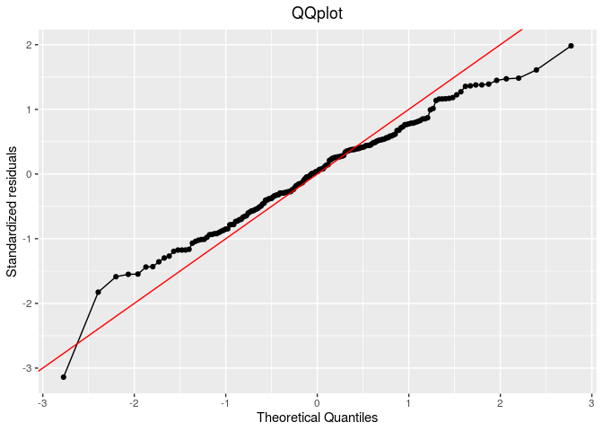
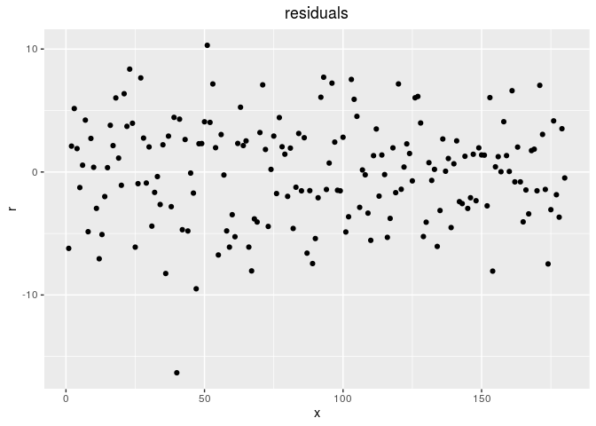
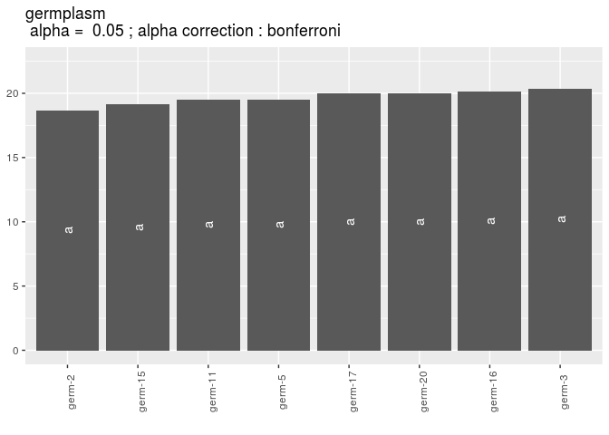
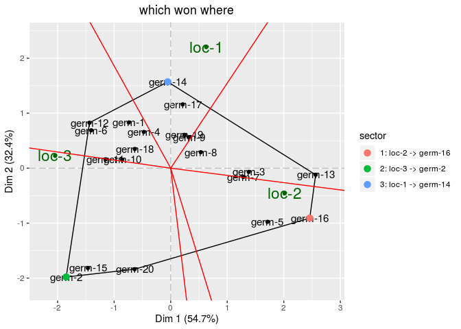
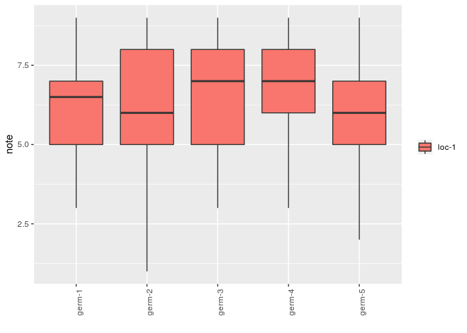
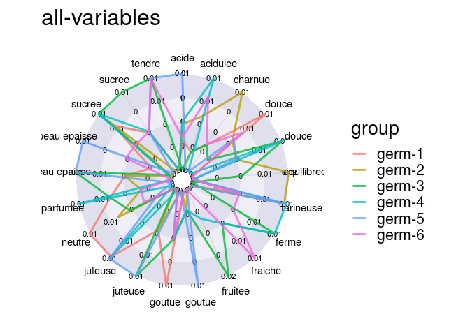

PPBstats
========

`PPBstats` is a freely available package based on the R software for
Participatory Plant Breeding statisticial analyses. It performs analyses
on the data collected during PPB programs at four levels:

-   network of seed management,
-   agronomic trials,
-   organoleptic tests and
-   molecular analyses.

The objectives of `PPBstats` are

1.  to have a single package capable of performing all analyses required
    for PPB programmes with comprehensive documentation, and
2.  to create a community working on PPB programmes in order to improve
    the package, exchange on how to process data from PPB programmes and
    develop good practices.

Examples of analysis performed by PPBstats
------------------------------------------

    library(PPBstats)

### Network of seed management

Descriptive analysis can be done regarding:

-   unipart network for seed lots analysis
-   unipart network for location analysis
-   bipart network analysis

Below an example on unipart network for seed lots analysis:

    # get data
    data(data_network_unipart_sl) 

    # format data for the package
    net_unipart_sl = format_data_PPBstats(
      type = "data_network",
      data = data_network_unipart_sl, 
      network_part = "unipart", 
      vertex_type =  "seed_lots")

    # Display outputs
    plot(net_unipart_sl, plot_type = "network", organize_sl = TRUE)

    ## [[1]]
    ## [[1]]$network

Other examples can be found in the book [here](book/network.html).

### Agronomic trials

Statistical analysis can be done

-   To compare different germplasms on each location for selection:
    -   classic anova,
    -   spatial analysis,
    -   mixed models,
    -   bayesian hierarchical model intra-location.
-   To study response of germplasm over several locations for selection:
    -   AMMI and GGE,
    -   bayesian hierarchical model G×E.

    In this section, several models are proposed for specific research
    questions:
-   To study specific research questions on one farm or more
    -   response to selection
    -   local adaptation with two models: home away and local foreign
    -   intra germplasm variance
-   To run multivariate analysis

Below an example on GGE model:

    # get data
    data(data_model_GxE)

    # format data for the package
    data_model_GxE = format_data_PPBstats(data_model_GxE, type = "data_agro")

Once the data are formated, the model is run

    # run the GGE model
    out_gge = model_GxE(data_model_GxE, variable = "y1", gxe_analysis = "GGE")

Then, check it, for example with residuals

    # check if the model went well
    out_check_gge = check_model(out_gge)
    p_out_check_gge = plot(out_check_gge)
    p_out_check_gge$residuals

    ## $histogram

    ## 
    ## $qqplot

    ## 
    ## $points

Then, compare means

    # get mean comparisons
    out_mean_comparisons_gge = mean_comparisons(out_check_gge, p.adj = "bonferroni")
    p_out_mean_comparisons_gge = plot(out_mean_comparisons_gge)
    p_out_mean_comparisons_gge$germplasm$`1`

Then, look at biplot

    # get biplot
    out_biplot_gge = biplot_data(out_check_gge)
    p_out_biplot_gge = plot(out_biplot_gge)
    p_out_biplot_gge$biplot$which_won_where

### Organoleptic tests

Sensory analysis can be done on

-   hedonic analysis
-   napping analysis
-   rank analysis

Below an example on hedonic analysis

    # get data
    data(data_hedonic)

    # format data for the package
    data_hedonic = format_data_PPBstats(data_hedonic, type = "data_organo_hedonic", threshold = 2)

    # descriptive analysis
    p_note = plot(data_hedonic, plot_type = "boxplot", x_axis = "germplasm",
                   in_col = "location", vec_variables = "note"
                   )
    p_note$note$`germplasm-1|location-1`

    descriptors = data_hedonic$descriptors

    p_des = plot(data_hedonic, plot_type = "radar", in_col = "germplasm", 
                             vec_variables = descriptors
                             )
    p_des$`all-variables`

A model can also be run.

Other examples can be found in the book [here](book/organoleptic.html).

### Molecular analyses

Under development …

Tutorial
--------

A full tutorial of `PPBstats` is available [in a
book](articles/2.book.html).

Mailing list `ppbstats@framalistes.org`
---------------------------------------

Exchange information about the R package PPBstats

You can subscribe to this mailing list to have news on the R package
`PPBstats` and share questions and remarks

Subscribe :
<a href="https://framalistes.org/sympa/subscribe/ppbstats" class="uri">https://framalistes.org/sympa/subscribe/ppbstats</a>
