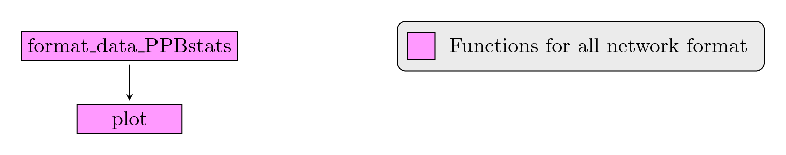

## Introduction

Network of seed circulation are interesting to have insight on how exchanges are structured within a PPB programme or a Community Seed House (we prefere the term instead of Community Seed Banks).
It can be done at several scale : local, regional and national.

Two types of network are handle within `PPBstats` :

- unipart network where a vertex can be
    - seed lot (i.e. a combinaison of a germplasm in a given location a given year) that can be linked by several relation such as diffusion, mixture, reproduction, crosses or selection for example.
    - location that represent each diffusion between location

- bipart network where a vertex can be a location or a germplasm


### Workflow and function relations in `PPBstats` regarding network analysis

The workflow is very simple as only descriptive analysis can be done.

Figure \@ref(fig:main-workflow-network) displays the functions and their relationships.
Table \@ref(tab:function-descriptions-workflow-network) describes each of the functions.

You can have more information for each function by typing `?function_name` in your R session.

```{r main-workflow-network, out.width='80%', fig.align='center', echo=FALSE, fig.cap="Main functions used in the workflow."}

```


| function name | description |
|---|---|
|`format_data_PPBstats` | Check and format the data to be used in `PPBstats` functions|
| `plot` | Build ggplot objects to visualize output |
Table: (\#tab:function-descriptions-workflow-network) Main function descriptions.


### Data format

Three formats are possible:

- unipart network for seed lots which represents relation between between seed lots: a data frame with the followin compulsory columns:
    - `"seed_lot_parent"` : name of the seed lot parent in the relation
    - `"seed_lot_child"` ; name of the seed lots child in the relation
    - `"relation_type"` : the type of relation between the seed lots
    - `"relation_year_start"` : the year when the relation starts
    - `"relation_year_end"` : the year when the relation stops
    - `"germplasm_parent"` : the germplasm associated to the seed lot father
    - `"location_parent"` : the location associated to the seed lot father
    - `"year_parent"` : represents the year of the last relation event of the seed lot father
    - `"germplasm_child"` : the germplasm associated to the seed lot child
    - `"location_child"` : the location associated to the seed lot child
    - `"year_child"` : represents the year of the last relation event of the seed lot child

It can have in option : `"alt_parent"`, `"long_parent"`, `"lat_parent"`, `"alt_child"`, `"long_child"`, `"lat_child"` to get map representation.
It can have supplementary variables with tags `"_parent"`, `"_child"` or `"_relation"`.

- unipart network for location which represents relation of germplasm diffusion between location: a data frame with the followin compulsory columns (explained above): `"location_parent"`, `"location_child"`, `"relation_year_start"`, `"relation_year_end"`.
It can have in option : `"germplasm_parent"`, `"year_parent"`, `"germplasm_child"`, `"year_child"`.
It can have in option : `"alt_parent"`, `"long_parent"`, `"lat_parent"`, `"alt_child"`, `"long_child"`, `"lat_child"` to get map representation.

- bipart network for germplasm and location which represent "which location has which germplasm which year": a data frame with the followin compulsory columns: `"germplasm"`, `"location"`, `"year"`.
It can have in option : `"alt"`, `"long"`, `"lat"` to get map representation


Note that format 1. can be convert to format 2. and 3. as summarized in Table \@ref(tab:network-format-analysis).
When bipart network come from unipart network for seed lots, relation reproduction and diffusion are taken.

| network format / analysis | unipart for seed lots | unipart for location | bipart for germplasm and location |
|---|---|---|---|
|unipart for seed lots | X | X | X |
|unipart for location | | X | |
|bipart for germplasm and location | | | X |
Table: (\#tab:network-format-analysis) Possible analysis regarding network format.

The format of the data are check by the function `format_data_PPBstats`. The following argument can be used :
- type = `data_network`
- network_part : `"unipart"` or `"bipart"`
- vertex_type :
    - for unipart network : `"seed_lots"` or `"location"`
    - for bipart network : `c("germplasm", "location")`
- network_split for network_part = "unipart" and vertex_type = "location", split of the data that can be "germplasm" or "relation_year_start"


Possible values of argument regarding network format are displayed in Table \@ref(tab:network-format-arg).

| network format / argument | network_part | vertex_type | network_split | 
| --- | --- | --- | --- | 
| unipart for seed lots |  `unipart` |  `seed_lots` |  NULL | 
| unipart for location |  `unipart` |  `location` |  `germplasm` or `relation_year_start` |
| bipart for germplasm and location |  `bipart` |  `c("germplasm", "location")` |  NULL | 
Table: (\#tab:network-format-arg) Possible values of argument regarding network format.

The following sections give exemples for each network format.
It returns a list with `igraph` object coming from `igraph::graph_from_data_frame()`.

#### unipart for seed lots
```{r}
data(data_network_unipart_sl)
head(data_network_unipart_sl)
```

- unipart for seed lots
```{r}
net_unipart_sl = format_data_PPBstats.data_network(
  data = data_network_unipart_sl, 
  network_part = "unipart", 
  vertex_type =  "seed_lots")
length(net_unipart_sl)
head(net_unipart_sl)
```

- unipart for location from unipart seed lots data
```{r}
net_unipart_location_g = format_data_PPBstats.data_network(
  data = data_network_unipart_sl, 
  network_split = "germplasm",
  network_part = "unipart", 
  vertex_type =  "location")
```

For `network_split = "germplasm"`, it returns a list with as many elements as germplam in the data
as well as all germplasms merged in the first element of the list.
An atttribute with the number of seed lots (`nb_sl`) for each location are added.
```{r}
names(net_unipart_location_g)
```

```{r}
net_unipart_location_y = format_data_PPBstats.data_network(
  data = data_network_unipart_sl, 
  network_split = "relation_year_start",
  network_part = "unipart", 
  vertex_type =  "location")
```

For `network_split = "relation_year_start"`, it returns a list with as many elements as year in the data
as well as all years merged in the first element of the list.
An atttribute with the number of seed lots (`nb_sl`) for each location are added.
```{r}
names(net_unipart_location_y)
```


- bipart for germplasm and location from unipart seed lots data
```{r}
net_bipart = format_data_PPBstats.data_network(
  data = data_network_unipart_sl, 
  network_part = "bipart", 
  vertex_type =  c("germplasm", "location")
  )
```

For bipart network, it returns a list with as many elements as year in the data 
as well as all years merged in the first element of the list.
If no year are provided into the data, all information are merged.

```{r}
names(net_bipart)
```

#### unipart for location
```{r}
data(data_network_unipart_location)
head(data_network_unipart_location)
```

```{r}
net_unipart_location_g = format_data_PPBstats.data_network(
  data = data_network_unipart_location, 
  network_split = "germplasm",
  network_part = "unipart", 
  vertex_type =  "location")
```

For `network_split = "germplasm"`, it returns a list with as many elements as germplam in the data
as well as all germplasms merged in the first element of the list.
An atttribute with the number of seed lots (`nb_sl`) for each location are added.
```{r}
names(net_unipart_location_g)
```

```{r}
net_unipart_location_y = format_data_PPBstats.data_network(
  data = data_network_unipart_location, 
  network_split = "relation_year_start",
  network_part = "unipart", 
  vertex_type =  "location")
```

For `network_split = "relation_year_start"`, it returns a list with as many elements as year in the data
as well as all years merged in the first element of the list.
An atttribute with the number of seed lots (`nb_sl`) for each location are added.
```{r}
names(net_unipart_location_y)
```

#### bipart for germplasm and location
```{r}
data(data_network_bipart)
head(data_network_bipart)
```

```{r}
net_bipart = format_data_PPBstats.data_network(
  data = data_network_bipart, 
  network_part = "bipart", 
  vertex_type =  c("germplasm", "location")
  )
```

For bipart network, it returns a list with as many elements as year in the data 
as well as all years merged in the first element of the list.
If no year are provided into the data, all information are merged.

```{r}
names(net_bipart)
```

