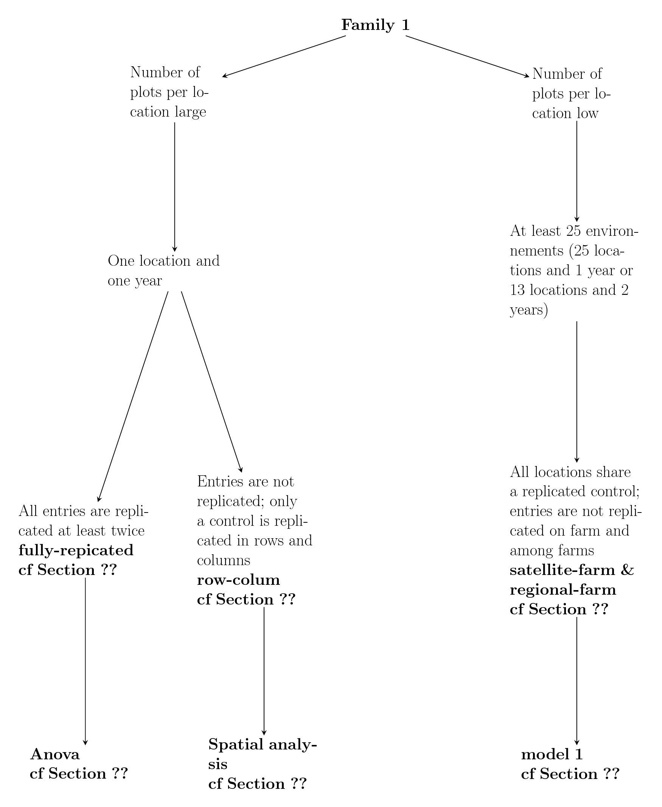
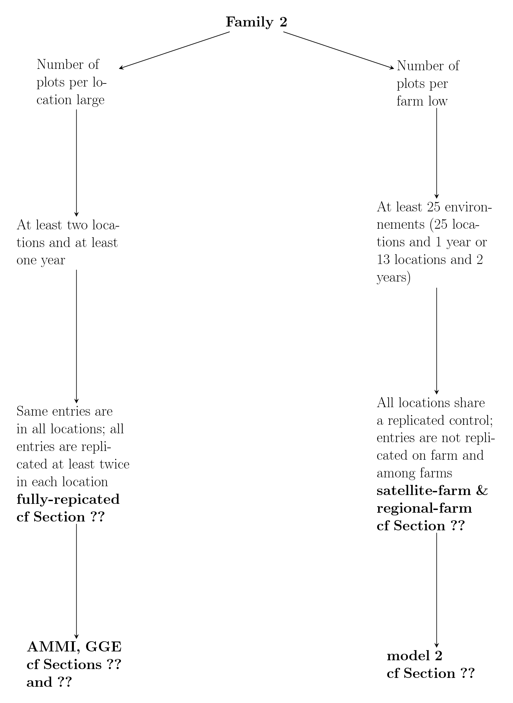
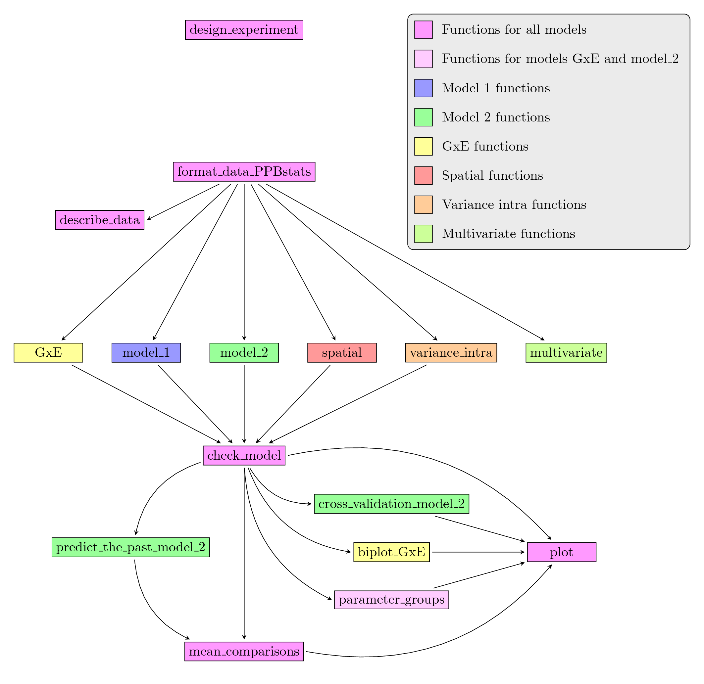

## Introduction

### Experimental design

Before sowing, you must plan the experiment regarding your research question, the amount of seeds available, the number of locations and the space available.

The experimental design is thought in relation to the analysis.
The key elements to choose an appropriate experimental design are:

- the number of locations
- the number of years
- the replication of entries within and between locations


Several designs used in PPB programmes are presented in Section \@ref(doe) and are mentionned in decision tree in Section \@ref(decision-tree).

Then, you can sow, note, harvest, measure (see Section \@ref(sow)) ...


### Analyses carried out

After describing the data (see Section \@ref(describe-data-agro)), you can run statistical analysis.

Table \@ref(tab:summary-analysis) summarizes the possible analyses in `PPBstats` and their specificities.
The various effects that can be estimated are:

- **entry**: a combination of a germplasm and an location or an environment
- **germplasm**
- **location**
- **environment**: a combination of a location and a year
- **interaction**: interaction between germplasm and location or germplasm and environment
- **year**
- **migrant-resident**: migrant refers to germplasm that was not grown on previous generation on location; resident refers to germplasm that was grown  on previous generation on location.
- **version**: version within a germplasm, for example selected vs non-selected

The analyses are divided into five families:

- **Family 1** gathers analysis that estimate entry effects. This is for analysis on one farm. 
It allows to compare different entries on each farm for selection.

- **Family 2** gathers analysis that estimate germplasm or location or interaction effects. This is for analysis in a network of farms. Estimation of environment and year effects are in option depending of the model. Specific analysis regarding migrant or residant can also be done.
It allows to study the response of germplasm over several farms or environnements for selection.

- **Family 3** gathers one analysis which estimates effects from family 1 and 2. This is for analysis in a network of farms. Environment effect can not be estimated as location, and year are separated.
It allows to study the response of entries over several farms or environnements for selection.

- **Family 4** gathers analysis answering specific research questions. 
This is for analysis on one farm or more.

- **Family 5** refers to multivariate analysis and is mentionned in Section \@ref{multivariate-analysis}.

Within family analysis 1 and 2, the differences are in the experimental designs which are presented in the next section.

| Family | Name | Section | entry effects | germpasm effects | location effects | environments effects | interaction effects | year effects | migrant-resident effects | version effects | variance intra population effects |
|--- | --- | --- | --- | --- | --- | --- | --- | --- | --- | --- | --- | 
|1 | Anova | \@ref(classic-anova) | X | | | | | | | |
|  | Spatial analysis | \@ref(spatial-analysis) | X | | | | | | | | |
|  | Bayesian model 1 | \@ref(model-1) | X | | | | | | | | |
|2 | IBD | \@ref(ibd) | | X | | | | | | | |
|  | AMMI | \@ref(ammi) | | X | X | (X) | X | (X) | | | |
|  | GGE | \@ref(gge) | | X | X | (X) | X | (X) | | | |
|  | Migrant-residant | \@ref(migrant-residant) | X | X | (X) | (X) | (X) | (X) | X | | |
|  | Bayesian model 2 | \@ref(model-2) | | X | X | (X) | X | | | | |
|3 | Bayesian model 3 | \@ref(model-3) | X | X | X | | X | X | | | |
|4 | Version | \@ref(version) | X | (X) | (X) | (X) | (X) | (X) | | X | |
|  | Variance intra | \@ref(variance-intra) | | | | | | | | | X |
Table: (\#tab:summary-analysis) Analyses carried out in `PPBstats`. X: effects that are estimated. (X): effects that can be estimated.

Analysis used in PPB programmes are mentionned in decision tree in Section \@ref(decision-tree).

#### Frequentist statistics

!!! TO DO !!!

##### Theory


##### Mean comparisons


#### Bayesian statistics {#section-bayes}

##### Theory

The analyses performed in `PPBstats` are based on Bayesian statistics.

Bayesian statistics are based on the Bayes theorem:

$Pr(\theta|y) \propto Pr(\theta) Pr(y|\theta)$

with
$Pr(\theta|y)$ the posterior,
$Pr(y|\theta)$ the likelihood and
$Pr(\theta)$ the prior.

The parameters' distribution, knowing the data (the posterior), is proportional to the distribution *a  priori* (the prior) $\times$ the information brought by the data (the likelihood).

The more information (i.e. the larger the data set and the better the model fits the data), the less the prior would be of importance.
If the priors equal the posteriors, it means that there is not enough data or the model does not fit the data.


Bayesian inference is based on the posterior distribution of model parameters.
This distribution could not be calculated explicitely for the hierarchical model used in here (see section \@ref{section-model1} and section \@ref{section-model2}) but could be estimated using Markov Chain and Monte Carlo (MCMC) methods.

These methods simulate values of model parameters according to a Markov chain that converges to the posterior distribution of model parameters [@robert_bayesian_2001].

MCMC methods were implemented using `JAGS` by the R package `rjags` that performed Gibbs sampling [@robert_bayesian_2001].
Two MCMC chains were run independently to test for convergence using the Gelman-Rubin test.
This test was based on the variance within and between the chains [@gelman_inference_1992].

A burn-in and lots of iterations were needed in the MCMC procedure.
In our case, the burn-in had 1000 iterations, then 100 000 iterations are done by default
^[You can change it with the argument `nb_iterations` in functions `model_1` and `model_2`] with a thinning interval of 10 to reduce autocorrelations between samples, so that 10 000 samples were available for inference for each chain by default
^[There are `nb_iterations/10` values for each chain. This can be changed with the `thin` argument of the functions.]
The final distribution of a posterior is the concatenation of the two MCMC chains: 20 000 samples.


##### Mean comparisons {#mean-comp}


In this part, the mean of each entry is compared to the mean of each other entry.
Let $H_{0}$ and $H_{1}$ denote the hypotheses:

$H_{0} : \mu_{ij} \ge \mu_{i'j} , \; H_{1} : \mu_{ij} < \mu_{i'j}$.

The difference $\mu_{ij}-\mu_{i'j}$ between the means of germplasm $i$ and population $i'$ in environment $j$ was considered as significant if either $H_{0}$ or $H_{1}$ had a high posterior probability, that is if $Pr\{H_{0}|y\} > 1 - \alpha$ or $Pr\{H_{1}|y\}> 1 - \alpha$, where
$\alpha$ was some specified threshold.
The difference was considered as not significant otherwise.
The posterior probability of a hypothesis was estimated by the proportion of MCMC simulations for
which this hypothesis was satisfied (Figure \@ref(fig:proba)).

Groups are made based on the probabilites.
Germplasms which share the same group are not different.
Germplasms which do not share the same group are different.

The threshold $\alpha$ that depends on agronomic objectives.
This threshold is set by default to $\alpha=0.1/I$ (with $I$ the number of entries in a given environnement).
It corresponded to a `soft' Bonferroni correction, the Bonferroni correction being very conservative.

As one objective of this PPB programme is that farmers (re)learn selection, the threshold could be adjusted to allow the detection of at least two groups instead of having farmers choose at random.
The initial value could be set to $\alpha=0.1/I$ and if only one group is obtained, then this value could be adjusted to allow the detection of two groups.
In this cases, the farmers should be informed of the lower degree of confidence that there are significant differences among entries.

```{r proba, out.width='70%', fig.align='center', echo=FALSE, fig.cap="Mean comparison between $\\mu_{ij}$ and $\\mu_{i'j}$"}
library(ggplot2)

nb = 100000
a = rnorm(nb, 55, 4)
b = rnorm(nb, 60, 4)
c = b - a

d1 <- with(density(a), data.frame(x, y))
d2 <- with(density(b), data.frame(x, y))
d3 <- with(density(c), data.frame(x, y))
d = rbind.data.frame(d1, d2, d3)
n = c(rep("mu_ij", nrow(d1)), rep("mu_i'j", nrow(d2)), rep("mu_i'j - mu_ij", nrow(d3)))
d = cbind.data.frame(d, n)

p = ggplot(data = d, mapping = aes(x = x, y = y, color = n))
p = p + geom_area(mapping = aes(x = ifelse(x<0 , x, 0)), fill = "red")
p = p + geom_area(mapping = aes(x = ifelse(x>0 & x<30 , x, 0)), fill = "gold")
p = p + geom_line(size = 2)
p = p + ylim(0,0.11) + theme(legend.position="none")

d_text = data.frame(
  n = c("mu_ij", "mu_i'j", "mu_i'j - mu_ij", "H1", "H0"),
  x = c(mean(a)-mean(a)/5, mean(b) + mean(b)/5, mean(c), -4, 4),
  y = c(0.1, 0.1, 0.075, 0.005, 0.005)
  )

p = p + geom_text(data = d_text, aes(x = x, y = y, label = n), size = 6) + theme_bw() + ylab("density") + xlab("")
p = p + theme(legend.position="none") + geom_abline() + scale_color_manual(values = c("#000000", "#000000", "#E69F00", "#009E73", "#CC79A7"))
p

# library(latex2exp)
# n = c(TeX("$\\mu_ij$"), TeX("$\\mu_i'j$"), TeX("$\\mu_i'j - \\mu_ij$"), "H1", "H0")

```

In `PPBstats`, mean comparisons are done with `mean_comparisons`.
You can choose on which parameters to run the comparison (`parameter` argument) and the $\alpha$ type one error (`alpha` argument).
The soft Bonferonni correction is applied by default (`p.adj` argument).
More informations on this function by typing `?mean_comparisons`.


### Decision tree {#decision-tree}

For each family of analysis, a decision tree is divided into five categories (Figure \@ref(fig:tree)):

- Family of analysis
- Number of plots per location
- Number of locations years
- Experimental design
- Statistical analysis

In Section \@ref(doe) regarding design of experiments, the branches of the decision tree concerned are displayed. 
Decision tree regarding Family 1 is displayed in Figure \@ref(fig:tree-f1).
Decision tree regarding Family 2 is displayed in Figure \@ref(fig:tree-f2).

```{r tree, out.width='20%', fig.align='center', echo=FALSE, fig.cap="Decision tree for analysis in `PPBstats`."}
knitr::include_graphics("figures/decision-tree-for-analysis-in-PPBstats.png")
```

```{r tree-f1, out.width='80%', fig.align='center', echo=FALSE, fig.cap="Decision tree regarding Family 1."}

```

```{r tree-f2, out.width='80%', fig.align='center', echo=FALSE, fig.cap="Decision tree regarding Family 2."}

```


### Workflow and function relations in `PPBstats` regarding agronomic analysis

After designing the experiment and describing the data, each family of analysis is implemented by several analysis with the same workflow :

- Run the model
- Check the model and visualize outputs
- Compare means and visualize outputs

Note that for model 2 and GGE other analysis are possible : predict the past and cross validation regarding model 2 and biplot regarding GGE.

`PPBstats` is divided into two sets of functions: Main functions and secondary, internal functions.
In this vignette, we only used examples with main functions as internal functions are called within main functions.

Figure \@ref(fig:main-workflow) displays the main functions and their relationships.
Table \@ref(tab:function-descriptions-workflow) describes each of the main functions.

You can have more information for each function by typing `?function\_name` in your R session.

```{r main-workflow, out.width='90%', fig.align='center', echo=FALSE, fig.cap="Main functions used in the workflow."}

```


| function name | description |
| --- | --- |
| `design_experiment` | Provides experimental design for several situations |
| `format_data_PPBstats` | | Check and format the data to be used in |pack~functions |
| `describe_data` | Describe the data set in order to choose the appropriate analysis to carry out |
| `model_1` | Run model 1 |
| `model_2` | Run model 2 |
| `GxE` | Run AMMI or GGE model |
| `spatial` | Run spatial row and column model |
| `model_variance_intra` | Run model variance intra |
| `multivariate` | Run multivariate analysis with function from `FactoMineR` |
| `check_model` |  Check if the model went well |
| `mean_comparisons` |  Get mean comparisons |
| `parameter_groups` | Get groups of parameters based on multivariate analysis |
| `cross_validation_model_2` | Run complete cross validation with model 2 |
| `predict_the_past_model_2` | Estimate value of a germplasm in an environment based on model 2 |
| `biplot_GxE` | Compute ecovalence and format PCA results |
| `plot` | Build ggplot objects to visualize output |
Table: (\#tab:function-descriptions-workflow) Main function descriptions.


### Data format

For `data-agro`, there are two format supported : `data-agro` and `data-agro-version`.

#### `data-agro`

`data-agro` format corresponds to all the data set used in the functions that run models.
The data have always the following columns : location, year, germplasm, block, X, Y as factors followed by the variables and their corresponding dates.
The dates are associated to their corresponding variable by `$`.
For example the date associated to variable `y1` is `y1$date`.

```{r}
data("data_GxE")
data_GxE = format_data_PPBstats(data_GxE, type = "data_agro")
head(data_GxE)
class(data_GxE)
```

#### `data-agro-version`

`data-agro-version` format corresponds to a specfic data set with pairs of entries in a given location. 
It is then possible to compare pairs of entries in a given location.
This is useful if you want to compare two versions within a group.

The data must have the following columns: year, germplasm, location, group, version as factors.
The group refers to an id that contains two different versions.
For example for group 1, there are version 1 and 2.
Within each group, there must have different version and different germplasm (i.e. each version must have different germplasms.).


```{r}
data(data_version)
data_version = format_data_PPBstats(data_version, type = "data_agro_version")
head(data_version)
```

Here, in location `env1-1`, `tem-1` and `tem-2` are two versions belonging to the same groupe.


