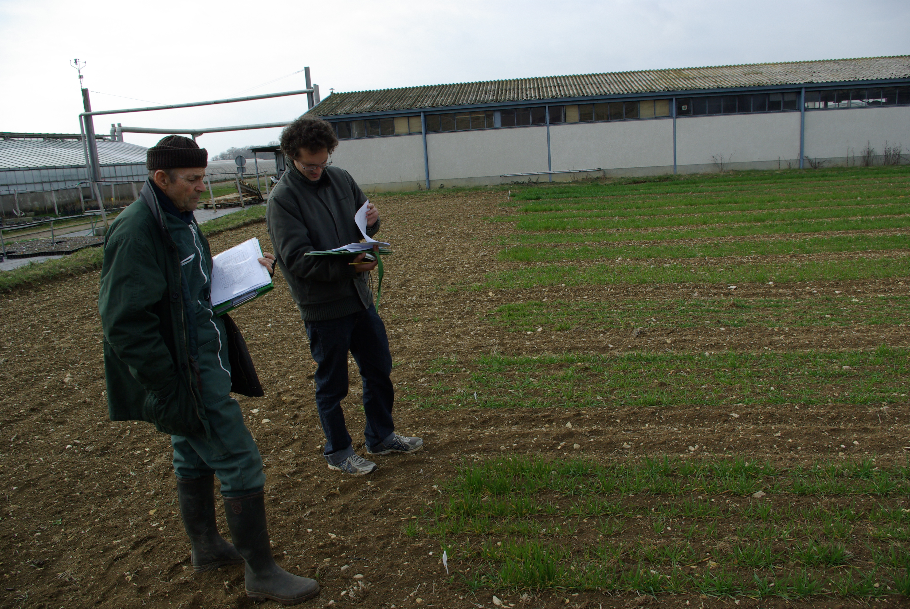
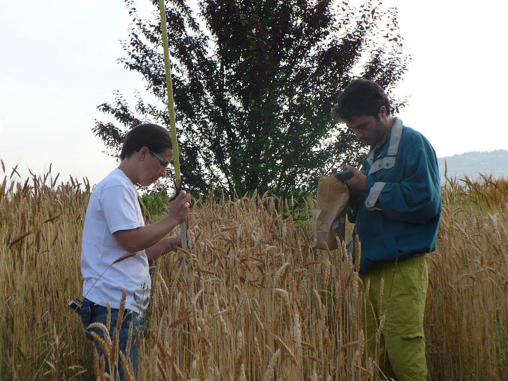
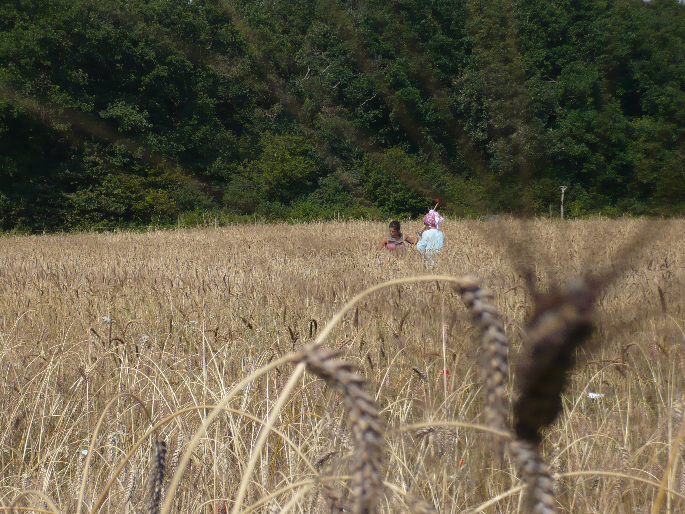
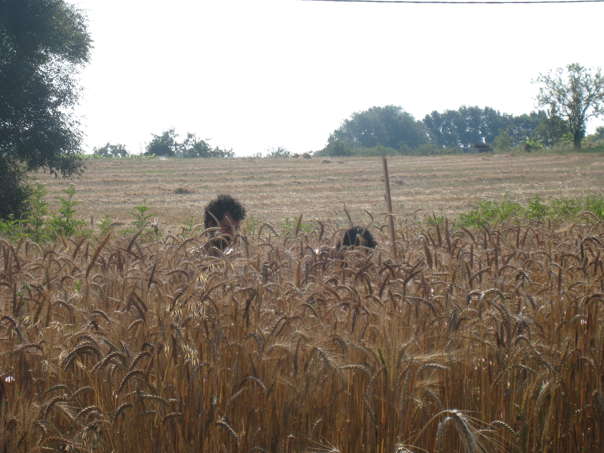

## Sow, note, harvest, measure ... {#sow}

PPBstats will not do it for you ... but here are some pictures !

```{r, out.width='50%', fig.align='center', echo=FALSE, fig.cap="[@2011_notation_hiver_chez_BER]"}

```

```{r, out.width='50%', fig.align='center', echo=FALSE, fig.cap="[@2011_notation_recolte_CHD]"}

```

```{r, out.width='50%', fig.align='center', echo=FALSE, fig.cap="[@FLM_2012]"}

```

```{r, out.width='50%', fig.align='center', echo=FALSE, fig.cap="[@2014_recolte_chez_JSG]"}
knitr::include_graphics("figures/2014_recolte_chez_JSG.JPG")
```

```{r, out.width='50%', fig.align='center', echo=FALSE, fig.cap="[@japhabelle8]"}

```

```{r, out.width='50%', fig.align='center', echo=FALSE, fig.cap="[@OLR-mesures14]"}
knitr::include_graphics("figures/OLR-mesures14.JPG")
```

