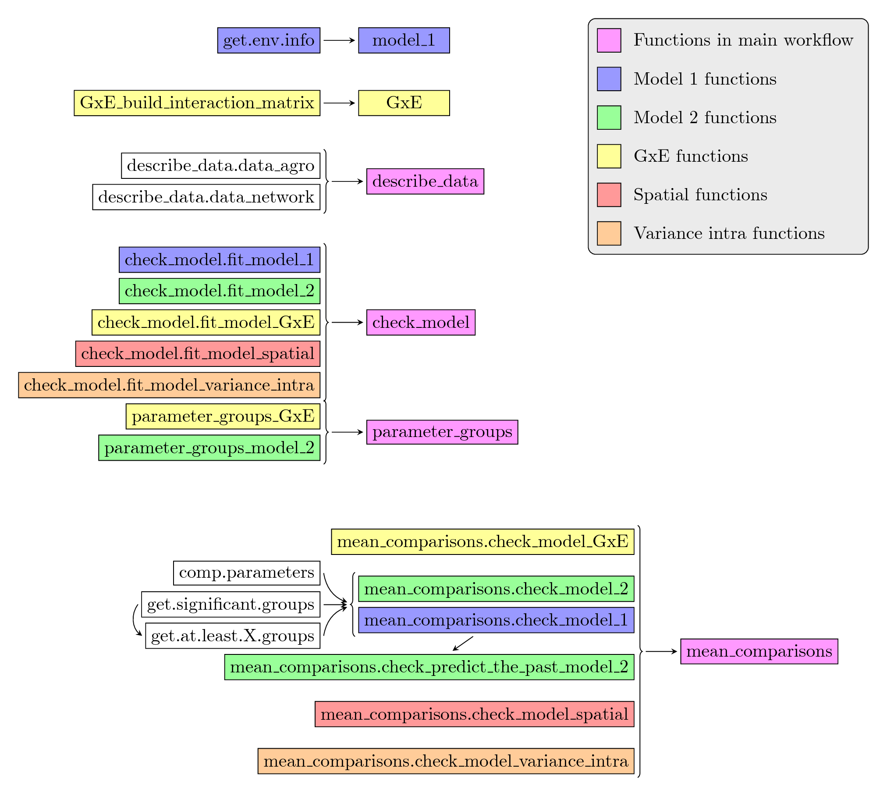
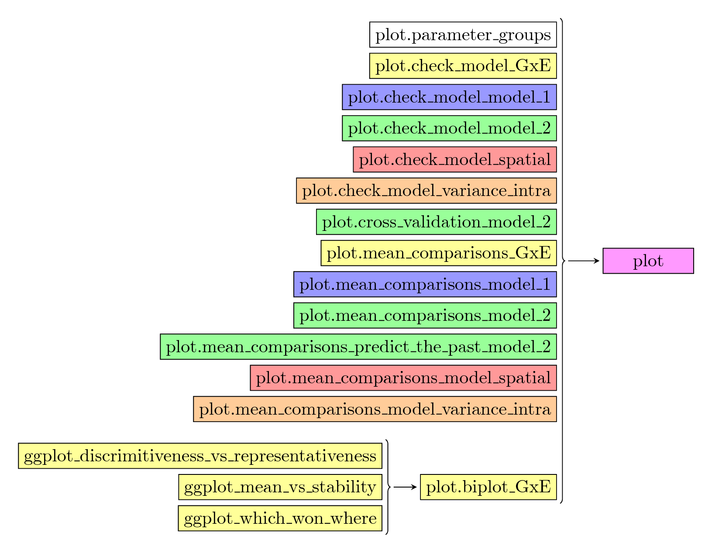

# Contribute to `PPBstats` {#contributions}

You can contribute to `PPBstats` in five ways:

- test `PPBstats` and its book and report bugs
- translate
- resolve open [issues](https://github.com/priviere/PPBstats/issues).
- add new functions 
- improve the book

The code of PPBstats is on github : https://github.com/priviere/PPBstats

The code of the book is also on github: https://github.com/priviere/PPBstats/tree/master/inst/bookdown

Anyhow, send me an email if you wish to participate in order to coordinate our efforts: pierre@semencespaysannes.org


## Test and report bugs

First, load the development version:

```{r, eval=FALSE}
devtools::install_github("priviere/PPBstats")
```


The easiest way to start is to look at the vignette to know how the package works.

You can download the vignette [here](https://github.com/priviere/PPBstats/releases/download/v0.22/PPBstats.pdf).
Do not hesitate to let a message [in the issues](https://github.com/priviere/PPBstats/issues).

- some points are not clear in the vignette or you find bugs
- you find bugs with your data (If so, you can send it to me so that I can see
where could be the problems)

## Translate

The package is in english. 
Every contributions to other languages are welcome!
More informations on R package translation [here](http://developer.r-project.org/Translations30.html).

## Resolve open issues

Do not hesitate to contribute to open [in the issues](https://github.com/priviere/PPBstats/issues).

## Add new functions

If you have any ideas, 

- on the improvement of the current package (graph or table for example)
- on new functions that may be useful in the analysis found within PPB programmes regarding network of seeds circulation, agronomic trials, organoleptic tests and molecular experiments.
- ...

even if it is not R written, send me an email and we'll see how we can work together!

If you wish to add a new model, you should follow different steps :

- create the model function
```{r}
my_model <- function(...){
  ...
  ...
  ...
  class(out) = c("PPBstats", "fit_my_model")
  return(out)
  }
```

- create the `fit_my_model` method for `check_model()`
```{r}
check_model.fit_my_model <- function(x){
  ...
  ...
  ...
  class(out) <- c("PPBstats", "check_my_model")
  return(out)
  }
```

- create the check\_my\_model method for `mean_comparisons()`
```{r}
mean_comparisons.check_my_model <- function(x, ...){
  ...
  ...
  ...
  class(out) <- c("PPBstats", "mean_comparisons_my_model")
  return(out)
  }
```

- create the `mean_comparisons_my_model` method for `plot()`
```{r}
plot.mean_comparisons_my_model <- function(x, y, ...){
  ...
  ...
  ...
  }
```


## How to contribute

- If you want to interact with us, please file an [issue](https://github.com/priviere/PPBstats/issues) or send me an email : pierre@semencespaysannes.org

- Fork the git repository
- Include your contributions in your fork (preferably in a specific branch)
- Update the documentation if necessary (help files, `inst/bookdown` file)
- Write unit tests for your functions, if any
- Pull the latest changes in the `master` branch of the upstream repository and rebase your work on top of them.
- Run all tests and compile the vignette. Make sure everything works as
expected.
- Send a Pull Request with a reference to the original issue


## Internal function structure

The internal function used in `PPBstats` are presented in Figure \@ref(fig:workflow-2-1) and  \@ref(fig:workflow-2-2) and Table \@ref(tab:function-descriptions-workflow-2). 
Note that one additional funtion is also defined in the package: `common_functions` which gather some functions used in several functions of `PPBstats`.


```{r workflow-2-1, out.width='100%', fig.align='center', echo=FALSE, fig.cap="Internal functions used within main functions (1/2)"}

```

```{r workflow-2-2, out.width='100%', fig.align='center', echo=FALSE, fig.cap="Internal functions used within main functions (2/2)"}

```


| function name | description |
| --- | --- |
| `get.env.info` | Get regional farms data and satellite farms data |
| `GxE_build_interaction_matrix` | Compute interaction matrix |
| `check_model.fit_model_1` | Check if the `model_1` model went well  |
| `check_model.fit_model_2` | Check if the `model_2` model went well |
| `check_model.fit_model_GxE` | Check if the `GxE` model went well |
| `check_model.fit_model_spatial` | Check if the `spatial` model went well |
| `check_model.fit_model_variance_intra` | Check if the `model_variance_intra` model went well |
| `parameter_groups_GxE` | Get matrix with variables in column and effects in row from `check_modelfit_model_GxE` |
| `parameter_groups_model_2` | Get matrix with variables in column and effect in row from `check_model.fit_model_2` |
| `comp.parameters` | Get parameter comparisons two by two or to a given threshold based on MCMC outputs |
| `get.significant.groups` | Get significant groups of means that are significantly different from each others for a set of parameters based on MCMC outputs |
| `get.at.least.X.groups` | Get the value of type one error needed to have X groups |
| `mean_comparisons.check_model_GxE` | Get mean comparisons from `check_model.fit_model_GxE` |
| `mean_comparisons.check_model_1` | Get mean comparisons from `check_model.fit_model_1` |
| `mean_comparisons.check_model_2` |Get mean comparisons from `check_model.fit_model_2`  |
| `mean_comparisons.check_model_spatial` | Get mean comparisons from `check_model.fit_model_spatial`  |
| `mean_comparisons.check_predict_the_past_model_2` | Get mean comparisons from `predict_the_past_model\_2` |
| `mean_comparisons.check_model_variance_intra` | Get mean comparisons from `check_model.fit_model_variance_intra` |
| `plot.parameter_groups` | Get ggplot from `parameter_groups` |
| `plot.check_model_GxE` | Get ggplot from `check_model.fit_model_GxE` |
| `plot.check_model_model_1` | Get ggplot from `check_model.fit_model_1` |
| `plot.check_model_model_2` | Get ggplot from `check_model.fit_model_2` |
| `plot.check_model_model_spatial` | Get ggplot from `check_model.fit_model_spatial` |
| `plot.check_model_variance_intra` | Get ggplot from `check_model.fit_model_variance_intra` |
| `plot.cross_validation_model_2` | Get ggplot from `cross_validation_model_2` |
| `plot.mean_comparisons_GxE` | Get ggplot from `mean_comparisons.check_model_GxE` |
| `plot.mean_comparisons_model_1` | Get ggplot from `mean_comparisons.check_model_1` |
| `plot.mean_comparisons_model_2` | Get ggplot from `mean_comparisons.check_model_2` |
| `plot.mean_comparisons_predict_the_past_model_2` | Get ggplot from `mean_comparisons.predict_the_past_model_2` |
| `plot.mean_comparisons_model_variance_intra` | Get ggplot from `mean_comparisons.check_model_variance_intra` |
| `plot.biplot_GxE` | Get ggplot from `biplot_GxE` |
| `ggplot_discrimitiveness_vs_representativeness` | Get "discrimitiveness vs representativeness" ggplot from PCA on interaction matrix |
| `ggplot_mean_vs_stability` | Get "mean vs stability" ggplot from PCA on interaction matrix |
| `ggplot_which_won_where` | Get "which won where" ggplot from PCA on interaction matrix |
Table: (\#tab:function-descriptions-workflow-2) Name and description of internal functions.

## Improve the book
If you wish to improve the book, to add new sections on PPB, etc please file an [issue](https://github.com/priviere/PPBstats/issues) or send me an email : pierre@semencespaysannes.org 

The code of the book is on github: https://github.com/priviere/PPBstats/tree/master/inst/bookdown
